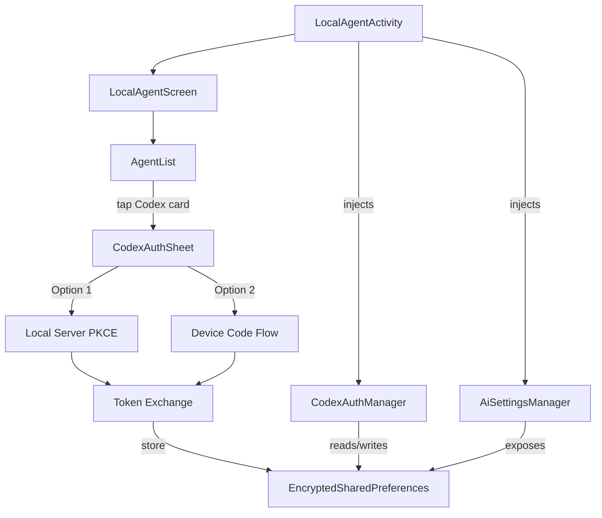

# Codex Authentication Implementation

> [!IMPORTANT]
> **BUILD SUCCESSFUL** — All files compile with 0 errors.

## Architecture

## Files Created

| File | Purpose |
|------|---------|
| [CodexAuthManager.kt](file:///c:/Users/BiuBiu/Documents/my%20app/amaya/app/src/main/java/com/amaya/intelligence/data/remote/api/CodexAuthManager.kt) | Core auth logic — PKCE + Device Code + token refresh + secure storage |
| [CodexAuthSheet.kt](file:///c:/Users/BiuBiu/Documents/my%20app/amaya/app/src/main/java/com/amaya/intelligence/ui/components/shared/CodexAuthSheet.kt) | Bottom sheet UI — method picker, device code display, loading/success states |

## Files Modified

| File | Change |
|------|--------|
| [AiSettings.kt](file:///c:/Users/BiuBiu/Documents/my%20app/amaya/app/src/main/java/com/amaya/intelligence/data/remote/api/AiSettings.kt) | Added `getEncryptedPrefsForCodex()` accessor |
| [ProviderRegistry.kt](file:///c:/Users/BiuBiu/Documents/my%20app/amaya/app/src/main/java/com/amaya/intelligence/data/remote/api/ProviderRegistry.kt) | Updated Codex provider: `DEVICE_FLOW` auth mode, `LOCAL_SECURE_STORAGE` |
| [AgentList.kt](file:///c:/Users/BiuBiu/Documents/my%20app/amaya/app/src/main/java/com/amaya/intelligence/ui/screens/agent/shared/AgentList.kt) | Added "Subscription Login" section with Codex card |
| [LocalAgentScreen.kt](file:///c:/Users/BiuBiu/Documents/my%20app/amaya/app/src/main/java/com/amaya/intelligence/ui/screens/agent/local/LocalAgentScreen.kt) | Wired Codex auth state + sheet trigger |
| [LocalAgentActivity.kt](file:///c:/Users/BiuBiu/Documents/my%20app/amaya/app/src/main/java/com/amaya/intelligence/ui/activities/agent/local/LocalAgentActivity.kt) | Injected `CodexAuthManager` via Hilt |
| [build.gradle.kts](file:///c:/Users/BiuBiu/Documents/my%20app/amaya/app/build.gradle.kts) | Added `androidx.browser:browser:1.8.0` dependency |

## Auth Flows

### Flow 1: Local Server PKCE (Recommended)
1. Binds `ServerSocket` on port 1455/1457/1459
2. Opens OpenAI auth URL in Chrome Custom Tab with PKCE challenge
3. User logs in → browser redirects to `localhost:PORT/auth/callback`
4. Server captures auth code, sends success HTML, exchanges code for tokens

### Flow 2: Device Code (Fallback)
1. Requests device code from `auth.openai.com/oauth/device/authorize`
2. Displays user code in monospace with copy button + countdown timer
3. User opens verification URL, enters code
4. Polls token endpoint every 5s until authorized or expired

### Token Storage
- All tokens stored in `EncryptedSharedPreferences` via `AiSettingsManager`
- Keys: `codex_access_token`, `codex_refresh_token`, `codex_id_token`, `codex_expires_at`, `codex_account_email`
- Auto-refresh when token expires within 5 minutes

## UI Flow
1. **AI Agents screen** → "Subscription Login" section shows Codex card
2. Tap card → **CodexAuthSheet** opens with two options
3. Choose method → auth flow executes
4. Success → snackbar + card shows green dot + email
5. Logout → tap exit icon on card
